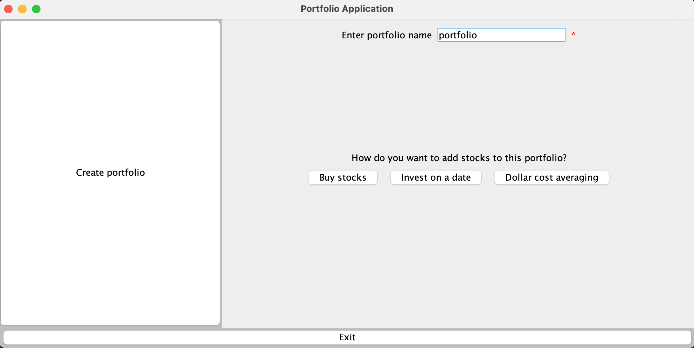

## Folder Structure
The Jar file must be inside res folder. The res folder should also contain a data folder. This data folder contains data.csv.

## Instructions to run the jar file
From the command prompt/console , type "java -jar a6.jar" to run the jar file for GUI interaction.

For a text based interaction , type "java -jar a6.jar text" instead.

## Instructions to format file to load data for GUI interaction

The data should be in the below format.
<pre>

{
  "name": "user3",
  "balance": 1200,
  "portfolios": [
    {
      "name": "flex",
      "flexible": true,
      "stocks": {
        "MSFT": {
          "2022-11-03": {
            "shares": 10,
            "transactionCost": 20
          }
        },
        "AAPL": {
          "2022-11-03": {
            "shares": 40,
            "transactionCost": 15
          }
        }
      },
      "dollarCost": [
        {
          "start": "2015-10-23",
          "end": "null",
          "transactionCost": 30,
          "amount": 2000.0,
          "interval": 30,
          "stocks": [
            {
              "GOOG": 10
            },
            {
              "META": 40
            },
            {
              "AAPL": 50
            }
          ]
        }
      ]
    }
  ]
}
</pre>

- There must be a balance field denoting the initial balance of the user.
- Each portfolio must have name field ,flexible field, stocks field and dollarCost field.
- Flexible field must be true(Our program does support inflexible portfolios but they cannot be accessed from the GUI)
- Stocks field can be empty , denoted by "stocks":[]
- dollarCost field can also be empty, denoted by "dollarCost":[]
- Even though they can be empty , both those fields must be present.

Stocks:
- Each stock should have an object with key as the stock symbol (refer to the list of valid symbols in data.csv),
- Each stock symbol should have an object with dates as the keys and transaction details as values.
- Each transaction should have the shares bought or sold(Sold shares are indicated with a negative sign.) and a transaction cost.

dollarCost:
- Each dollarCost should have start , end , transactionCost,interval and stocks fields.
- The start and end dates must be in yyyy-mm-dd formats.
- If end date is not determined , it should be mentioned as "null".
- Interval must be an integer denoting the number of days.
- Each stock in the stocks field must have stock symbols with their weights. 
- The weights should all add to 100.
- If any of the above constraints are violated , the file will be deemed as incorrectly formatted and the program will not load the file.

Please make sure the brackets and commas are correctly formatted and none of the fields should contain any of “{}[]:,” characters.

This file must be saved as “username”.json (the same username mentioned in the file.) inside the data folder.

## Instructions to create a user

- Click on create user button in the initial menu. You will be prompted to enter the username and initial balance.
- Please make sure the username you enter does not contain any of “{}[],: ” characters and the initial balance is a positive floating point number.
- You can choose to skip the initial balance field, and it will take a default value of 0.
- After creating a user , you must create a portfolio. There will be no option to save/persist the user without creating a portfolio.

## Instructions to create a flexible portfolio

After successful creation of a user , the new user menu is displayed as shown below.

- Click on the create portfolio button.
- You will be asked to enter the portfolio name.Please note that the portfolio name must not contain any of "{}[],:" characters.
- You should select how do you wish to add stocks in this portfolio.
- You can select one of three options:
  - 1.Buy stocks
  - 2.Invest on a date
  - 3.Dollar cost averaging
- Depending on what you select , the respective menu will open and you can always click on "go back" to switch to a different method instead.
- Note: Each time you click on "go back" , you will have to enter the portfolio name again.

	### 1.Buy stocks:
		->In this menu , you will be asked to enter the stock symbol ,date on which you want to buy the stock, the number of shares and the commission fee.
		->The stock symbol must be a valid stock symbol(refer to data.csv for a list of valid symbols)
		->The date must be in yyyy-mm-dd format and must not be a weekend or a future date.
		->The number of shares must be a valid positive integer.
		->The commission fee must be a valid positive floating point number.
		->The "Buy stock" button will work only if all of the above constraints are satisfied.
		->If any of the above constraints are violated, an error message is shown and the buy stocks won't be bought.

	### 2.Invest on a date:
		->In this menu,you will be asked to enter the amount,date on which you want to invest,the commission fee and a list of stock symbols and weights.
		->You can click on "Add a stock" button to add more stocks. This button will only work if all of the previous stock symbols are valid and have positive floating point weights.
		->The "Invest" button will work only if all the weights sum to 100.
		->If any of the above constraints are violated, an error message is shown and the buy stocks won't be bought.
	
	### 3.Dollar cost averaging:
		->In this menu,you will be asked to enter the amount,start date,end date,interval,the commission fee and a list of stock symbols and weights.
		->The dates must be in yyy-mm-dd format.
		->Start date cannot be a weekend or a future date.
		->End date can be left empty or a future date.
		->Interval must be a positive integer denoting the number of days.
		->You can click on "Add a stock" button to add more stocks. This button will only work if all of the previous stock symbols are valid and have positive floating point weights.
		->The "Invest" button will work only if all the weights sum to 100.
		->If any of the above constraints are violated, an error message is shown and the buy stocks won't be bought.

- If stocks were bought successfully , "successfully created portofolio" message will be shown and the main menu will be displayed , like below:

## Instructions to load portfolio/switch to a different portfolio
- To switch to a different portfolio, click on the "Load portfolio" button and enter the portfolio name.
- If a portfolio with that name exists , click on "Load portfolio" button and it will successfully load the portfolio.
- If there is no such portfolio with the entered portfolio name , "Portfolio does not exist" message will be shown.

## Instructions to buy stocks
- Click on "Buy stock" in the main menu.You will see the below screen:

- You have to enter a stock symbol, date,number of shares and commission fee.
- Make sure the symbol is valid.(A list of valid stock symbols can be foud in data.csv in the data folder).
- Commission fee must be a valid positive floating point number
- Date must be in yyyy-mm-dd format and must not be a weekend or a future date.
- Number of shares must be a valid positive integer.
- The "Buy stock" button will work only if all of the above constraints are satisfied.
- If any of the above constraints are violated, an error message is shown and the buy stocks won't be bought.
- Upon successful buying , the main menu will be shown with "successfully bought stocks" message.

## Instructions to sell stocks
- Click on the "Sell stock" button in the main menu.
- You have to enter a stock symbol, date,number of shares and commission fee.
- Make sure the symbol is valid.(A list of valid stock symbols can be foud in data.csv in the data folder).
- Commission fee must be a valid positive floating point number
- Date must be in yyyy-mm-dd format and must not be a weekend or a future date.
- Number of shares must be a valid positive integer.
- The "Sell stock" button will work only if all of the above constraints are satisfied.

Note: You should have enough shares of that stock in your portfolio to sell those shares and this transaction must be consistent with previous transactions.

## Instructions to query cost basis on a certain date
- Click on "Get Cost basis" in the main menu. You will see the below screen.

- Enter date in yyyy-mm-dd format. Date cannot be weekend or a future date.
- Click on "Get cost basis" to view the cost basis.

## Instructions to query total value on certain date
- Click on "Get Value" in main menu.
- Enter the date.(Date must be in yyyy-mm-dd format and must not be a weekend or a future date.)
- It might take a few seconds to display the total value(because of an api call in the backend).

## Instructions to Invest on a date
- Click on "Invest on date" button from the main menu
- Enter the amount, date on which to buy the stocks and the transaction cost.
- Enter first stock symbol and its weight %. 
- Click on "Add a stock" to add more stocks.
- "Add a stock" will work only if the previous stock symbol is valid and the weight % is a valid positive floating point number.
- The amount will not be invested if the weights provided by the user do not add to 100 and an error message is shown to the user on the screen.
- The amount, transaction cost and weights must be positive floating point numbers.
- The stock symbols must be valid ticker symbols.
- The date must be in valid yyyy-mm-dd format and must not be a weekend or a future date.
- The amount will be invested only when all of the above constraints are valid and a "successfully invested" message is shown.
- The user is notified immediately if something goes wrong.

## Instructions for dollar-cost averaging
- Click on "Dollar Cost-Averaging" button.
- Enter the amount , start date , end date ,interval, commission fee and the stock symbols with their weights.
- The dates must be in yyyy-mm-dd formats and start date cannot be a weekend or a future date and is a required field.
- The end date can be empty or a future date but cannot be a weekend.
- Interval must be an integer specifying the number of days
- Enter first stock symbol and its weight %.
- Click on "Add a stock" to add more stocks.
- "Add a stock" will work only if the previous stock symbol is valid and the weight % is a valid positive floating point number.
- The weights should add to 100.
- If all of the above constraints are valid, "successfully invested" message will be shown.

## Instructions to plot performance of portfolio
- Click on "View Performance Plot" from the main menu.
- Enter start date and end date. 
- Both dates must be in yyyy-mm-dd format and cannot be weekend or future dates.
- It might take a couple of minutes for the plot to be drawn if there are a lot of calculations to be done in dollar cost averaging. 
- However, while the plot is being drawn , you can still click on other buttons such as querying cost basis and value or view list of portfolios.
- Note: While the plot is being drawn , do not click on buy/sell stock and view performance again. Wait till the plot is drawn first , you can click on these buttons later.
- Resize the window to get a better view of the plot.
- If the labels on the X-axis seem squeezed , resize the window to get a better view.
- The values on the Y-axis are dynamic and adapt accordingly when resized.

